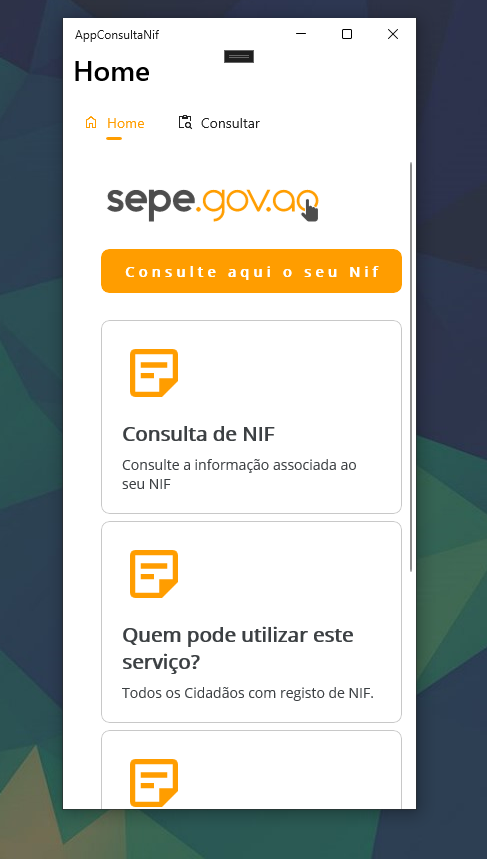
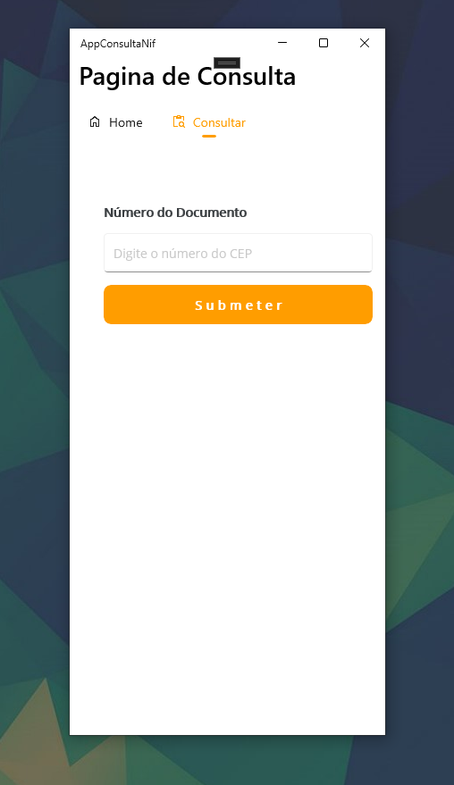

# AppMeuNif

**AppConsultaNif** é uma aplicação desenvolvida em .NET MAUI que permite aos usuários consultar informações associadas ao Número de Identificação Fiscal (NIF). Com uma interface intuitiva e funcional, a aplicação oferece uma forma rápida e fácil de obter dados detalhados sobre o NIF inserido.

## Funcionalidades

- **Consulta de NIF:** Permite que o usuário insira o número do NIF e faça uma requisição a uma API para obter informações detalhadas associadas ao número fornecido.
- **Exibição de Dados:** Exibe os dados retornados da API de forma organizada e clara na tela, permitindo fácil visualização das informações.
- **Detalhamento em JSON:** Ao clicar em um painel contendo o nome associado ao NIF, é exibida uma mensagem com todas as informações detalhadas em formato JSON.
- **Tratamento de Erros:** Informa o usuário sobre qualquer erro ocorrido durante a consulta, como números inválidos ou problemas de comunicação com o servidor.

## Screenshots

### Tela Inicial

### Resultado da Consulta

## Tecnologias Utilizadas

- **.NET MAUI:** Framework utilizado para o desenvolvimento da aplicação, permitindo a criação de interfaces de usuário nativas para iOS, Android, macOS e Windows com um único código base.
- **HttpClient:** Utilizado para fazer as requisições HTTP à API.
- **JsonSerializer:** Utilizado para serializar e deserializar os dados JSON retornados pela API.
- **MVVM (Model-View-ViewModel):** Padrão de arquitetura que separa a lógica de apresentação da lógica de negócios, facilitando a manutenção e teste do código.

## Configuração

Para configurar a aplicação, siga os passos abaixo:

1. **Clone o repositório:**

   git clone https://github.com/Serafimgonga/AppMeuNif.git
   cd AppConsultaNif
